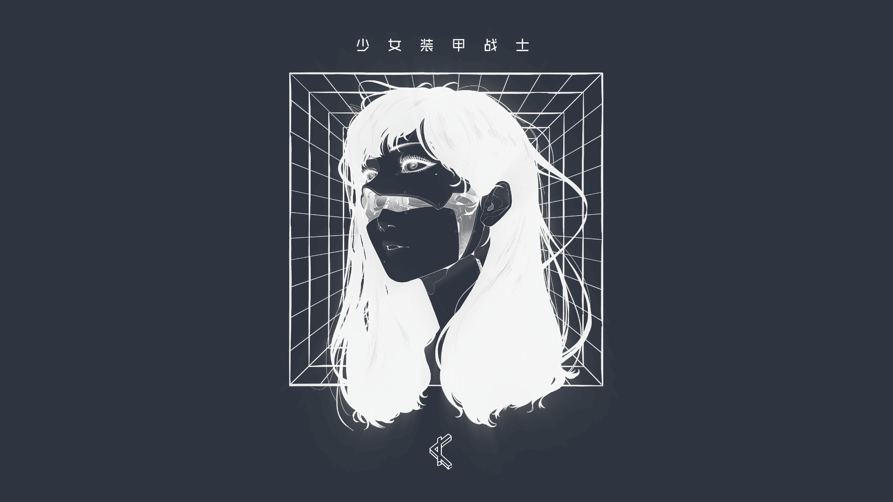

walls
--------------------------------------------------------------------------------
Personal collection of desktop wallpapers. This repo coould optionally be used in
conjunction with the [wal](https://github.com/jaimecgomezz/sh/blob/master/wal)
script, to dynamically change your wallpaper.

dark
----------------------------------------

gruvbox
----------------------------------------

blood
----------------------------------------

colors
----------------------------------------

forest
----------------------------------------

light
----------------------------------------

pantone
----------------------------------------

synth
----------------------------------------

nord
----------------------------------------

catppuccin
----------------------------------------

notice
--------------------------------------------------------------------------------
I know some of them are vertical, i just liked them that much.
I'll create an acknowledgements file in order to properly credit authors.

resources
--------------------------------------------------------------------------------
[1](https://github.com/dxnst/nord-wallpapers)
[2](https://nordthemewallpapers.com/)
[3](https://unsplash.com/collections/10775041/000000/add35e757dad99b50f9190060c2b8009)
[4](https://unsplash.com/collections/10775052/ffffff/a4ac63bf4ba28981b4392d2a846c499d)
[5](https://www.reddit.com/r/wallpapers/)
[6](https://www.reddit.com/r/unixporn)
[7](https://github.com/FrenzyExists/wallpapers)
